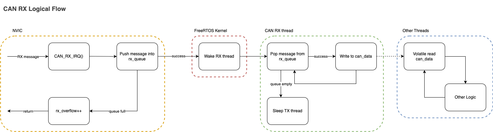
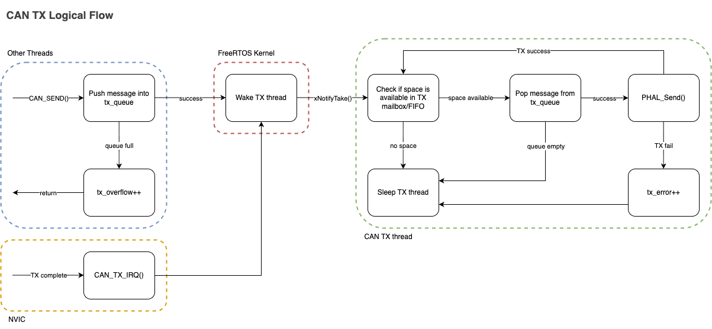
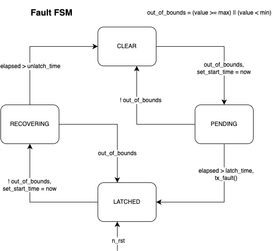

# PER CAN Library
Standardized framework for CAN communication and system-wide fault management within PER vehicles.

- `canpiler/`: Jinja2-based Python module for parsing configurations and generating code
- `configs/`: "Source of Truth" definitions for nodes, buses, and system-wide faults.
- `generated/`: Auto-generated C files and headers for CAN nodes.
- `dbc/`: CAN database (DBC) files for external analysis tools.
- `schema/`: JSON schemas for validating configuration files.

**Core Files:**
- `can_common.h / .c`: Shared hardware abstraction and logic.
- `faults_common.h / .c`: System-wide fault management.
- `can_library.cmake`: CMake integration and node library generation.

## Logic
The high-level logic flow of an RX is shown here:

> [!NOTE]
> The all RX IRQs push to the same queue rather than having separate queues per peripheral.

The high-level logic flow of a TX is shown here:

> [!NOTE]
> The actual implementation of the CAN TX task manages up to 3 seperate hardware peripherals at once, each with its own software queue.

## Usage
1. Define your CAN network and global faults in `can_library/configs/` using the provided JSON schemas.
    1. Use FDCAN peripherals on G4 and CAN peripherals on F4/F7.
2. Add to `COMMON_LIBRARIES` of your target: `can_node_<node_name>`.
3. Include the generated header for your node (e.g. `#include "common/can_library/generated/can_node_<node_name>.h"`) in your `main.c`.
3. Initialize the CAN library in your `main.c` with `CAN_init()`.
4. Setup CAN tasks in your `main.c` using `DEFINE_CAN_TASKS()` and `START_CAN_TASKS()`.

The most recent rx'd data is available in the `can_data` struct, which is updated by the CAN RX task.
Sending CAN messages is done via the generated `CAN_SEND_<message_name>()` functions, which enqueue messages to be sent by the CAN TX task.

## Fault System
The `faults_common` module implements the **FIDR (Fault Isolation, Detection, and Recovery)** system. It manages the lifecycle of system-wide faults using a robust Finite State Machine (FSM) to prevent flickering and ensure deterministic fault handling.

### Usage:
- `update_fault(fault_index, value)`: Called by the owner node to feed sensor/status data into the FSM.
- `fault_library_periodic()`: Tally active faults and broadcast a `tx_fault_sync` message.
- `is_latched(fault_index)`: Check if a specific fault is active.
- `is_clear(fault_index)`: Check if a specific fault is clear.

> [!NOTE]
> Each node is assigned a specific range of faults (`MY_FAULT_START` to `MY_FAULT_END`).
> Only the "owner" node can update the state of these faults, ensuring a single source of truth.
