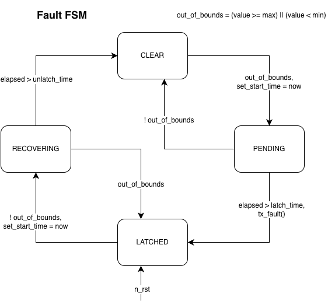

# PER CAN Library
Standardized framework for CAN communication and system-wide fault management within PER vehicles.

- `canpiler/`: Jinja2-based Python module for parsing configurations and generating code
- `configs/`: "Source of Truth" definitions for nodes, buses, and system-wide faults.
- `generated/`: Auto-generated C files and headers for CAN nodes.
- `dbc/`: CAN database (DBC) files for external analysis tools.
- `schema/`: JSON schemas for validating configuration files.

**Core Files:**
- `can_common.h / .c`: Shared hardware abstraction and logic.
- `faults_common.h / .c`: System-wide fault management.
- `can_library.cmake`: CMake integration and node library generation.

## Usage
1. Define your CAN network and global faults in `common/can_library/configs/` using the provided JSON schemas.
2. Add to `COMMON_LIBRARIES` of your target: `can_node_<node_name>`.
3. Define your RX interrupt handlers to call `CAN_handle_irq(CAN_TypeDef *bus, uint8_t fifo)`

> [!NOTE]
> Weird quirk: we run the CANpiler twice.
> Once during CMake configuration time and one during build time.
> This avoids any possibility of building with stale generated files.

## Fault System
The `faults_common` module implements the **FIDR (Fault Isolation, Detection, and Recovery)** system. It manages the lifecycle of system-wide faults using a robust Finite State Machine (FSM) to prevent flickering and ensure deterministic fault handling.

### Usage:
- `update_fault(fault_index, value)`: Called by the owner node to feed sensor/status data into the FSM.
- `fault_library_periodic()`: Tally active faults and broadcast a `tx_fault_sync` message.
- `is_latched(fault_index)`: Check if a specific fault is active.

> [!NOTE]
> Each node is assigned a specific range of faults (`MY_FAULT_START` to `MY_FAULT_END`).
> Only the "owner" node can update the state of these faults, ensuring a single source of truth.

