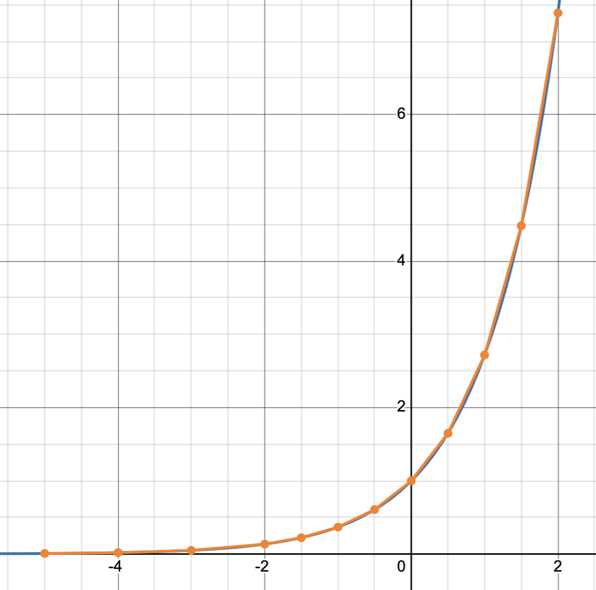

# lerp_lut
The `lerp_lut` module provides a simple way to create and use lookup tables (LUTs) for linear interpolation in C.
- keys outside the LUT range will be clamped to the nearest endpoint
- the LUT must have at least 2 entries to be valid
- the keys array must be unique and sorted in ascending order
- binary search is used to find the interval for interpolation to remain efficient for larger LUTs
- of course, accuracy depends on the size of the LUT and the range of keys.

#### Usage Example:
This example demonstrates a LUT being created for the exponential function. It is much faster to look up values from the LUT than to compute the exponential function directly, especially on our target platforms (Cortex-M4 with FPU).
```c++
#include "lerp_lut.h"

static constexpr int LUT_SIZE = 12;
const float keys[LUT_SIZE] = {
    -5.0f,
    -4.0f,
    -3.0f,
    -2.0f,
    -1.5f,
    -1.0f,
    -0.5f,
    0.0f,
    0.5f,
    1.0f,
    1.5f,
    2.0f,
};

const float values[LUT_SIZE] = {
    0.006f,
    0.018f,
    0.049f,
    0.135f,
    0.223f,
    0.367f,
    0.606f,
    1.0f,
    1.648f,
    2.718f,
    4.481f,
    7.389f,
};

LERP_LUT_INIT(exp_lut, keys, values, LUT_SIZE);

int main() {
    lut_lookup(&exp_lut, 0.75f);

    return 0;
}
```

