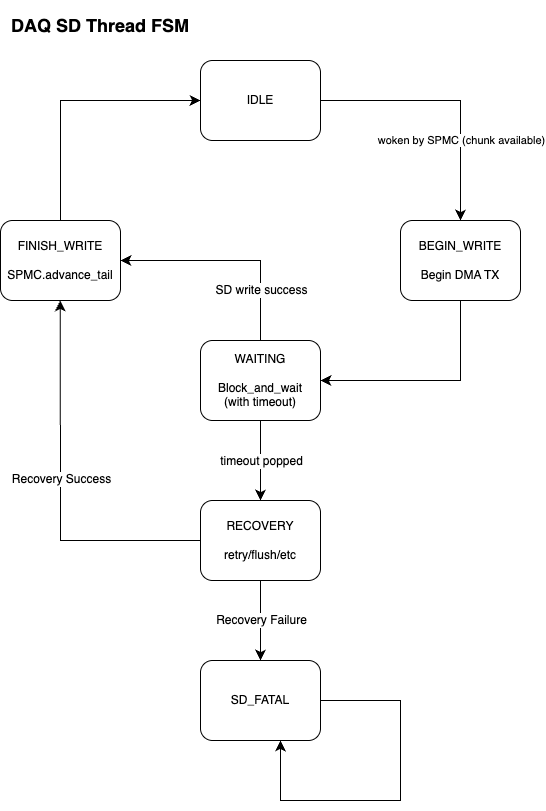
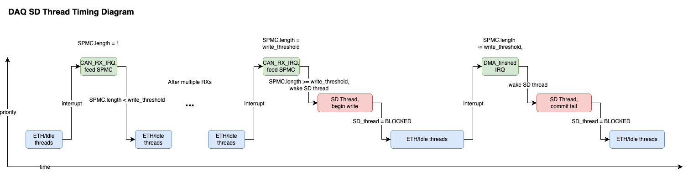

# Data Acquisition Board

This directory contains the firmware source code for the Data Acquisition (DAQ) board, responsible for data collection, storage, and streaming.

## Directory Structure
- `main.c / main.h` - Main entry point for DAQ firmware, responsible for initialization and thread management.
- `can_irq/` - CAN RX IRQ implementations, consuming CAN busses and feeding the SPMC
- `spmc/` - Custom lockless Single Producer Multiple Consumer queue implementation for high throughput data buffering between CAN IRQs and consumer threads (SD card writing, Ethernet streaming).
- `rtc_sync/` - Synchronization of the RTC peripheral with the reported GPS time
- `sd_card/` - SD logging and file management
- `ethernet/` - Real-time UDP streaming of CAN bus activity wirelessly

## DAQ SPMC Queue
Specialized data structure designed specifically for DAQ.
- Lockless
- Priority aware
- High throughput
- DMA friendly

DAQ26 setup:
- Producer(s): CAN1 and CAN2 ISRs
- Master Consumer: SD thread
- Follower Consumer: Ethernet thread

Notes:
- Even though there are actually two producing ISRs (CAN1 and CAN2), they have the same priority and cannot preempt each other, so we can treat them as a single producer for the purposes of this data structure.
- Data is returned to the consumers in contiguous chunks to optimize for DMA transfers.
    - The total capacity of the buffer is sized to be a multiple of chunk size to prevent fragmentation.
- If the SD thread falls behind, data will be dropped until it catches up. These "overflows" are tracked in a counter.
    - Several buffer parameters can be tuned to reduce the likelihood of overflows.
- If the ETH thread falls far behind the SD thread, it will fast-forward its tail to the location of the SD thread. The "dropped frames" are also tracked in a counter.

> [!NOTE]
> todo more detailed docs

