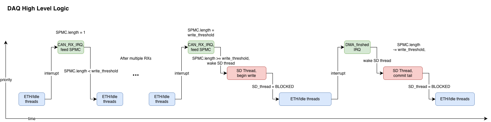

## DAQ Lockless SPMC Queue
Specialized data structure designed specifically for DAQ.
- 

Guiding design requirements:
- Single producer (CAN_IRQs w same priority)
- Multiple Consumer (SD, ETH)
- the SD tail must never miss a message (or else mark overflow)
- the ETH tail does "best effort streaming"
- high throughput, lock free

Assumptions:
- Even though there are actuall two producing ISRs (CAN1 and CAN2), they have the same priority and cannot preempt each other, so we can treat them as a single producer for the purposes of this data structure.
- We do not care if the follower tail "drops" data, as long as the master tail is guaranteed to consume all messages

> [!NOTE]
> todo more detailed docs

