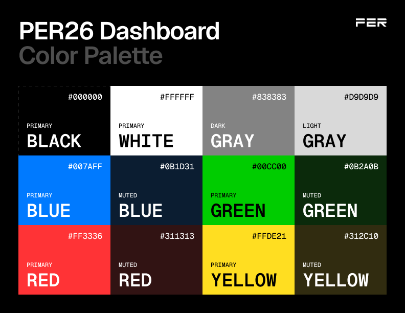

## Dashboard LCD
Code for handling the LCD display and user input on the dashboard. This includes page management, button callbacks, and telemetry updates.
- `pages/`: Contains individual page implementations.
- `lcd.c`: Top level logic for handling page updates and button interactions.
- `lcd.h`: Header file defining the page handler structure and function prototypes.

todo:
- faults page
- torque vector settings
- error pages

