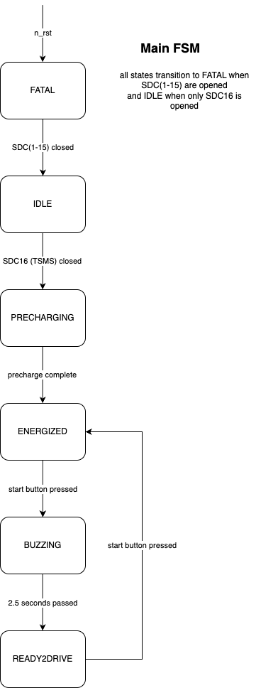

## Main Module
Main module is the master control unit of the car. It manages the global state of the car, checks SDC status, interfaces with inverters, and manages the final torque request.

The primary state machine is implemented in `state_machine.c` and the state diagram is as follows:

- Note that the definition of the `car_state_t` enum itself is located in `can_library/common_types.json` and generated into shared header files by the CANpiler.